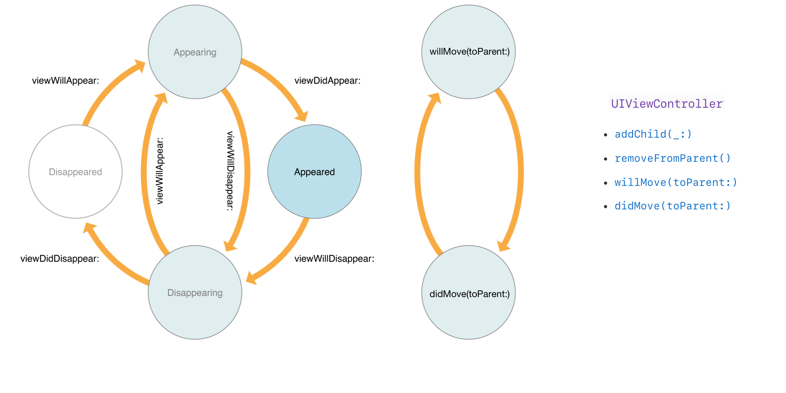

#  ViewControllerMadness

Detecting the first `viewDidAppear(_:)` and the last `viewDidDisappear(_:)`

**Project Repo:** [github.com/E-B-Smith/ViewControllerMadness](https://github.com/E-B-Smith/ViewControllerMadness)

## The Problem

In iOS 13, the presentation style of view controllers changed so that the methods `viewDidAppear(_:)` and `viewDidDisappear(_:)` are more likely to be called multiple times. This changed from iOS 12, were usually `viewDidAppear(_:)` would be called once when the view appeared and `viewDidDisappear(_:)` would be called once when the view disappeared.

Also, swipe gestures to dismiss a view controller, either from a non-fullscreen `modalPresentationStyle` or swiping back in a navigation controller, became more fully embraced in iOS 13. This "broke" back/dismiss button functionality, so a view controller might not be able to call a completion delegate or block when it was dismissed.

### View Controller Life Cycle



```swift
//
// UIViewController Callback Methods
//

// Views:

func viewWillAppear(_:)             // Called when the view may show.
func viewDidAppear(_:)              // Called when the view did show.
func viewWillDisappear(_:)          // Called when the view may hide.
func viewDidDisappear(_:)           // Called when the view did hide.

// View Controllers:

// Called when a view controller adds a child view controller.
func addChild(_:)

// Called when a view controller may move from to a new parent.
func willMove(toParent:)

// Called when a view controller did move from to a new parent.
func didMove(toParent:)

// Called when a view controller will be removed from a parent.
func removeFromParent() // Not consistently used.
```

### Okay, so what's the problem?

* When is the real first time a view controller's view shown?

* When is a view controller really done? When is the last time `viewDidDisappear(_:)` called? Waiting until `deinit` is called is too late.

### Use Cases

#### Analytics: When should analytics be fired?

An awkward mitigation is setting a boolean in `viewDidAppear(_:)`. There's no easy mitigation for `viewDidDisappear(_:)`.

#### Navigation controllers: The 'Back' button is not necessarily pressed

For navigation controllers, a partial mitigation is setting the `self.navigationController?.presentationController?.delegate`:

```swift
self.navigationController?.presentationController?.delegate = self
```

and getting the delegate callback:

```swift
extension BasicViewController: UIAdaptivePresentationControllerDelegate {
    func presentationControllerDidDismiss(_ presentationController: UIPresentationController) {
        self.handlePushedControllerDismissal()
    }
}
```

This doesn't work well for view controllers that do logic when the back button is pressed: The logic may have to be called from two different place (back button handler and this delegate) since either may be called.

#### Not Always Easy to Mitigate

It's not so easy to detect when non-fullscreen view controllers are  dismissed.

## Possible Solution: ViewControllerMadness!

After looking into view controller callback methods, `NSNotifications`, and other options, I added some optional view controller methods via magic (swizzling):

```swift
class SomeViewController: UIViewController {
    optional func viewControllerDidPresent() {
        // Called once when the view first appeared.
    }
    optional func viewControllerDidDismiss() {
        // Called once when the  view finally disappears.
    }
```

and two global `NSNotifications` that are posted when the view is first shown and the last time it's dismissed:

```swift
/// The notification sender is the view controller that presented.
public let NSNotification.Name.UIViewControllerDidPresent;

/// The notification sender is the view controller that dismissed.
public let NSNotification.Name.UIViewControllerDidDismiss;
```

These are non-standard UIViewController methods and notifications that don't require inheriting from a base class such as `AffirmVC`.

This works for all view controllers, including alerts and system view controllers.

### Use Case: Analytics

Create automatic analytics without boiler plate or using `AffirmVC`.

```swift
extension BasicViewController: UIViewController, AnalyticsNaming {
    var analyticsName: String { return "basic_view_controller" }
}
```

In analytics:

```swift
    ...
    NotificationCenter.default.addObserver(
        self,
        selector: #selector(viewControllerPresented(notification:)),
        name: .UIViewControllerDidPresent,
        object: nil
    )
    ...
    func viewControllerPresented(notification: NSNotification) {
        if let sender = notification.sender as? AnalyticsNaming {
            Analytics.log("UserViewsPage", page: sender.analyticsName)
        }
    }
```

### Use Case: Navigation Controller Dismissal

What's the easiest way to handle a dismissal callback?

* Adding a `dismissalDelegate` delegate?
* Adding a `NotificationCenter` observer?
* Adding a `dismissal` block callback?

#### Examples

##### Dismissal with Delegate

```swift
class SomeViewController: UIViewController {
    func pushViewController() {
        let nextController = NextController()
        nextController.dismissalDelegate = self // Magic!
        self.navigationController.pushViewController(nextController)
    }
}
```

##### Dismissal with Notifications

```swift
class SomeViewController: UIViewController {
    func pushViewController() {
        let nextController = NextController()
        let notificationToken = NotificationCenter.default.addObserver(
            forName: UIViewControllerDidDismiss,
            object: nextController,
            queue: nil
        ) { [weak self] notification in
            // Do dismiss stuff here.
            self?.nextControllerWasDismissed()
            // Make sure to un-register!
            NotificationCenter.default.removeObserver(notificationToken)
        }
        self.navigationController.pushViewController(nextController)
    }
}
```

##### Dismissal with Block

```swift
class SomeViewController: UIViewController {
    func pushViewController() {
        let nextController = NextController()
        nextController.dismissal = {
            // Maybe get a value from the controller:
            self.selectedTerm = nextController.selectedTerm
        }
        self.navigationController.pushViewController(nextController)
    }
}
```

## Research

### View Controllers

https://developer.apple.com/documentation/uikit/uiviewcontroller
https://developer.apple.com/documentation/uikit/view_controllers/showing_and_hiding_view_controllers
https://www.hackingwithswift.com/example-code/uikit/how-to-detect-when-the-back-button-is-tapped

https://stackoverflow.com/questions/21915249/how-to-detect-if-view-controller-is-being-popped-of-from-the-navigation-controll
https://stackoverflow.com/questions/32853212/detect-when-a-presented-view-controller-is-dismissed
https://stackoverflow.com/questions/8228411/detecting-when-the-back-button-is-pressed-on-a-navbar
https://en.proft.me/2019/11/6/understanding-ios-viewcontroller-life-cycle/

### Using UIAdaptivePresentationControllerDelegate

UIPresentationController

```swift
self.navigationController?.presentationController?.delegate = self
...
extension BasicViewController: UIAdaptivePresentationControllerDelegate {
    func presentationControllerDidDismiss(_ presentationController: UIPresentationController) {
        self.postLifeCycleNotification()
    }
}
```

### Notifications

http://iphonedevwiki.net/index.php/SpringBoard.app/Notifications
https://nshipster.com/inter-process-communication/

### Swizzling Notes

https://pspdfkit.com/blog/2019/swizzling-in-swift/
http://defagos.github.io/yet_another_article_about_method_swizzling/
https://steipete.com/posts/calling-super-at-runtime/

https://stackoverflow.com/questions/32480213/how-to-call-imp-in-swift
https://www.vadimbulavin.com/code-injection-swift/

### Naive Swizzling

https://medium.com/@valsamiselmaliotis/method-swizzling-in-swift-2ff25926569d
https://abhimuralidharan.medium.com/method-swizzling-in-ios-swift-1f38edaf984f
https://nshipster.com/swift-objc-runtime/
